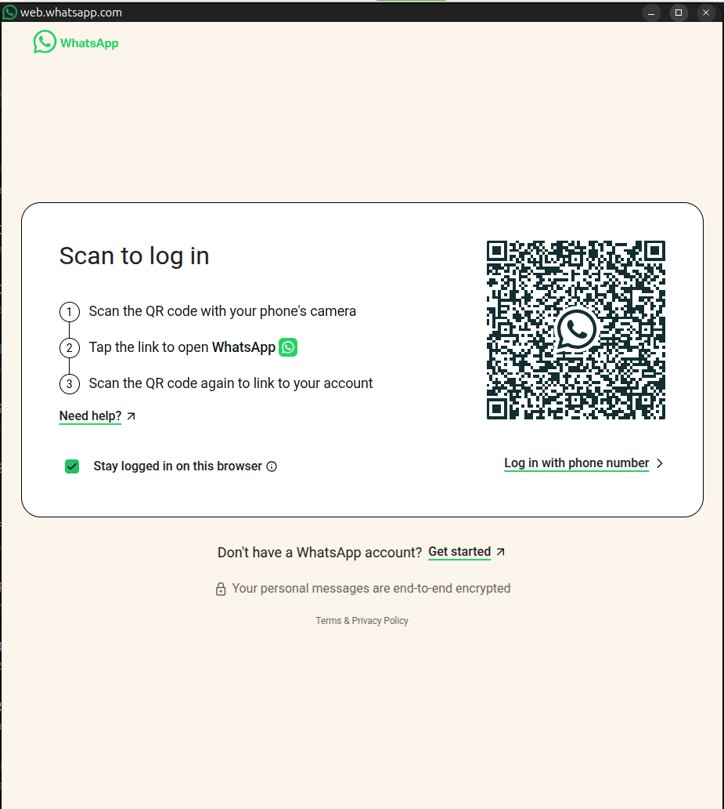

# site2linux

Transforma uma URL em um aplicativo integrado ao menu do Linux. Cada site tem
uma janela própria, sem abas, e um perfil separado para cookies, permissões e
downloads. É uma alternativa leve a empacotar um navegador inteiro em cada app.


## Requisitos

- Linux com ambiente gráfico;
- Python 3.9 ou mais recente;
- Chromium, Google Chrome, Brave ou Microsoft Edge instalado.

Não requer `sudo` nem instala bibliotecas Python.

## Uso

```bash
chmod +x site2linux.py
./site2linux.py create https://app.example.com --name "Meu App" --id meu-app
```

O aplicativo passa a aparecer no menu do sistema. Para escolher um navegador:

```bash
./site2linux.py create https://web.whatsapp.com --name WhatsApp --browser chrome
```

Navegadores disponíveis: `auto` (padrão), `chromium`, `chrome`, `brave` e
`edge`.

Por padrão, o programa usa o nome do `manifest`, `og:site_name` ou título da
página e baixa o ícone oficial declarado pelo site. Use `--name` apenas se
quiser substituir o nome mostrado no menu.

## Certificado de uma rede interna

Não use opções que ignoram erros de certificado: elas deixariam o aplicativo
vulnerável a sites falsos. Se um endereço interno como `https://cml2.lan` usa
uma CA própria, solicite ao administrador **o certificado PEM da CA** (não o
certificado temporário exibido pelo navegador) e confie nele explicitamente:

```bash
./site2linux.py trust-ca /caminho/ca-da-empresa.pem
./site2linux.py create https://cml2.lan --name CML2 --ca-cert /caminho/ca-da-empresa.pem
```

O comando valida que o arquivo é uma CA e o instala apenas no repositório NSS
do seu usuário, usado por Chrome/Chromium. É necessário ter `openssl` e o
pacote `libnss3-tools` (que fornece `certutil`). Reinicie as janelas do
Chrome/Chromium após a instalação. A CA deve vir de uma fonte confiável da sua
empresa/escola; o programa nunca baixa nem aceita automaticamente um
certificado apresentado pelo site.

## Remover

```bash
./site2linux.py remove meu-app
```

Os arquivos ficam somente no perfil do usuário: `~/.local/share/site2linux`,
`~/.local/share/applications` e `~/.local/share/icons`. Nenhum arquivo do
sistema é alterado.

## Limites

O site continua sendo uma aplicação web; funcionalidades como modo offline,
notificações e acesso a câmera dependem do site e do navegador escolhido. Para
websites que exigem DRM, use Chrome/Edge ou um Chromium com Widevine instalado.
# site2linux
